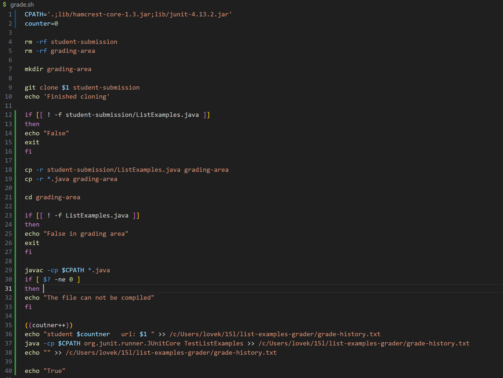
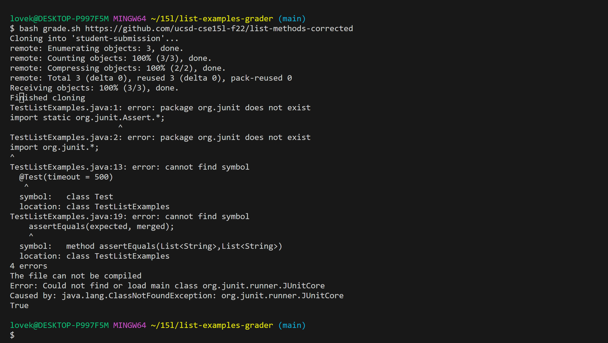
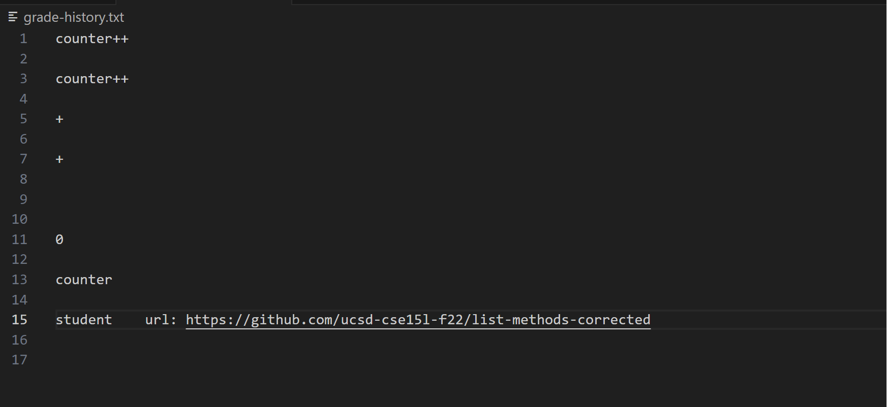

# CSE15L
## Lab Report 5
### Step 1

+ The original post from a student with a screenshot showing a symptom and a description of a guess at the bug/some sense of what the failure-inducing input is. (Don’t actually make the post! Just write the content that would go in such a post)
  
  Hello, I am working on week6 "student submission", I am struggling with two problems below:

  + I couldn't figure out that why my bash code doesn't give me a expected outputs.And even if I run the correct student's submission it still ouputs the "The file can not "
  The correct one I used is (https://github.com/ucsd-cse15l-f22/list-methods-corrected).

    
    

  + And I try to add a .txt file in the LIST-EXAMPLES-GRADER, which records the student's submission that matching with students. it should recorde every students submission out put in order of I tested. And I also want to know how many students I tested on, my expected formation is like below 
    number of students  +  url  + linechange + output
    

+ A response from a TA asking a leading question or suggesting a command to try (To be clear, you are mimicking a TA here.)

  For first problem you can try to copy the lib directory to the grading-area and find the bash. It might happen when the java can not find class in the current working directory.
  And for the second problem, everytime the code is running the counter value refreshed. You might forget that we need to use for in the one run time. We can not set variable for every time we run the file. But you can write a for loop for searching the student1 , student2 , if there is no student# for some certain number then you can write the number for this time .

+ Another screenshot/terminal output showing what information the student got from trying that, and a clear description of what the bug is.
+ At the end, all the information needed about the setup including:
  
The contents of each file before fixing the bug
The full command line (or lines) you ran to trigger the bug
A description of what to edit to fix the bug

### Step 2

